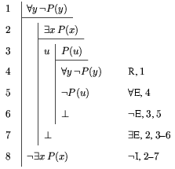

# fitch.sty

LaTeX macros for Fitch style natural deduction

## Usage

Fitch-style natural deduction is a system for writing proofs in
propositional logic and predicate logic. This is a set of easy-to-use
LaTeX macros originally written by Peter Selinger. It is used, e.g.,
in the various versions of _forall x_ by PD Magnus (e.g., the
[original](https://www.fecundity.com/logic/download.html),
[Cambridge](http://www.homepages.ucl.ac.uk/~uctytbu/OERs.html), and
[Calgary](https://forallx.openlogicproject.org) versions)

With these macros, one can typeset natural deduction proofs in Fitch
style, as in the following example:



```
\begin{nd}
  \hypo {1} {\forall y \neg P(y)}
  \open          
    \hypo {2} {\exists x P(x)}
    \open[u]       
      \hypo {3} {P(u)}
      \have {4}{\forall y \neg P(y)}  \r{1}
      \have {5} {\neg P(u)}           \Ae{4}
      \have {6} {\bot}                \ne{3,5}
    \close
    \have {6a} {\bot}                 \Ee{2,3-6}
  \close
  \have {7} {\neg \exists x P(x)}     \ni{2-6a}
\end{nd}         
```

The output is shown above, and the corresponding LaTeX code below.

## Changes

**v1.0-beta, October 15, 2023** Adds `outerline` option; improves
`\by`; fixes spacing when using `tabular`

**v1.0-alpha, Sept 30, 2023** This is an alpha release that adds key-value
options to the package and commands for customization. It is not fully
compatible with the 0.x versions (see documentation). Please report
any issues or suggestions.

**v0.6, Sept 4, 2023.** Updated the documentation and license (from
GPL to LPPL). The code is essentially unchanged.

**v0.5, Feb 8, 2005.** The ability to handle multi-line formulas
was added.

## Download

The package is available on CTAN as
[`fitch`](https://ctan.org/pkg/fitch).

The code is [maintained on Github](https://github.com/OpenLogicProject/fitch/).

## Related packages

- [`logicproof`](https://ctan.org/pkg/logicproof): natural deduction
  with boxed subproofs in the style of Huth and Ryan's _Logic in
  Computer Science_.
- [`lplfitch`](https://ctan.org/pkg/lplfitch): Fitch-style proofs in
  the format used in Barwise & Etchemendy's textbook _Language, Proof,
  and Logic_.
- [`natded`](https://ctan.org/pkg/natded): natural deduction proofs
  in the style of Jaśkowski, or that of Kalish and Montague.
- [`synproof`](https://ctan.org/pkg/synproof): natural deduction
  proofs in the style of Gamut's _Logic,
  Language, and Meaning_.


Additional packages for proofs, including Johan Klüwer's, are
available at a [page maintained by Alex Kocurek](https://www.actual.world/latex/)

## People

Peter Selinger, Dalhousie University, is the original author.

Richard Zach, University of Calgary, it the current maintainer.

## License

Copyright (C) 2002-2023 Peter Selinger

This work may be distributed and/or modified under the conditions of
the LaTeX Project Public License, either version 1.3 of this license
or (at your option) any later version. The latest version of this
license is in

  https://www.latex-project.org/lppl.txt 

and version 1.3c or later is part of all distributions of LaTeX
version 2008 or later.